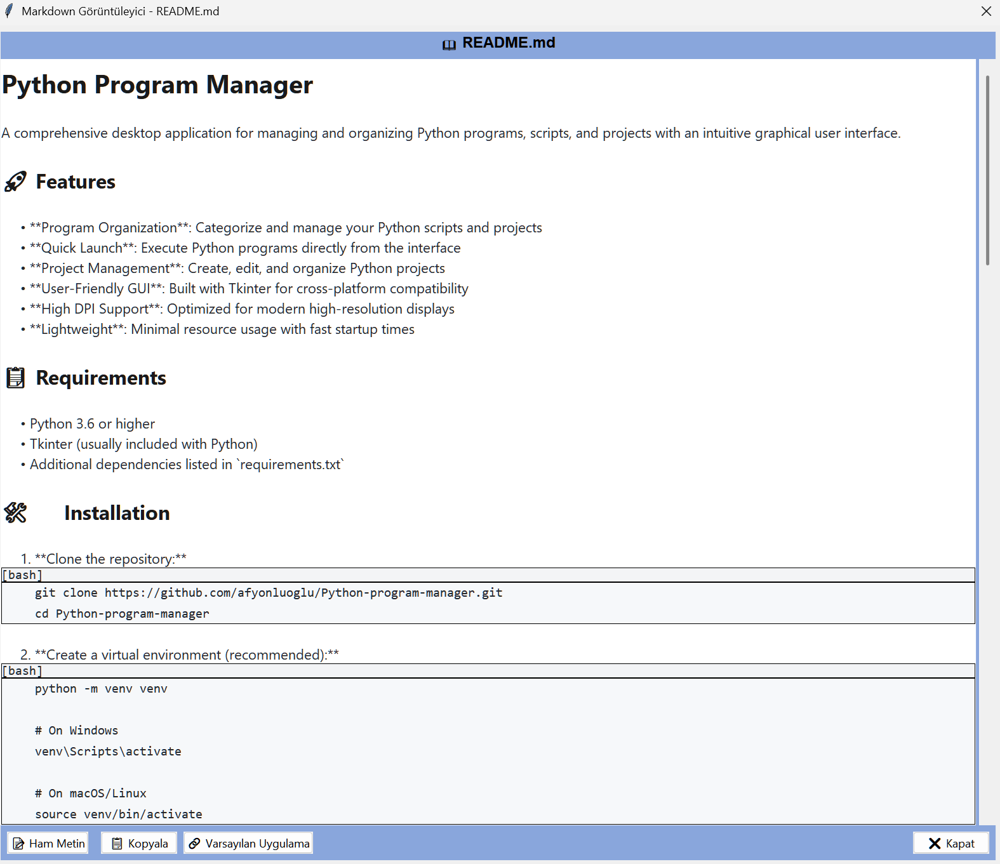

# Python Program Manager

A comprehensive desktop application for managing and organizing Python programs, scripts, and projects with an intuitive graphical user interface.

## 🚀 Features

- **Program Organization**: Categorize and manage your Python scripts and projects
- **Advanced Python Editor**: Built-in syntax highlighting and code editing capabilities
- **Code Analysis Tools**: Analyze Python code structure, methods, and dependencies
- **Theme Management**: Multiple visual themes for personalized experience
- **History Management**: Track and manage your program execution history
- **Context Menus**: Right-click context menus for quick actions
- **Markdown Viewer**: Built-in markdown file viewer and editor
- **Dependency Analysis**: Analyze and visualize project dependencies
- **Method Analysis**: Detailed analysis of Python methods and functions
- **Quick Launch**: Execute Python programs directly from the interface
- **User-Friendly GUI**: Built with Tkinter for cross-platform compatibility
- **High DPI Support**: Optimized for modern high-resolution displays
- **Lightweight**: Minimal resource usage with fast startup times

## 📸 Screenshots

### Main Interface with Theme Management


### Built-in Python Editor


### Code Analysis Features


### Method Analysis Tool


### Dependency Analysis


### History Manager


### Context Menu Features


### Markdown Viewer


## 📋 Requirements

- Python 3.6 or higher
- Tkinter (usually included with Python)
- Additional dependencies listed in `requirements.txt`

## 🛠️ Installation

1. **Clone the repository:**
   ```bash
   git clone https://github.com/afyonluoglu/Python-program-manager.git
   cd Python-program-manager
   ```

2. **Create a virtual environment (recommended):**
   ```bash
   python -m venv venv
   
   # On Windows
   venv\Scripts\activate
   
   # On macOS/Linux
   source venv/bin/activate
   ```

3. **Install dependencies:**
   ```bash
   pip install -r requirements.txt
   ```

## 🚀 Usage

### Running the Application

```bash
python main.py
```

### Basic Operations

1. **Launch the Application**: Run `python main.py`
2. **Code Editing**: Use the built-in Python editor with syntax highlighting
3. **Code Analysis**: Analyze your Python code structure and dependencies
4. **Theme Selection**: Choose from multiple visual themes
5. **History Tracking**: View and manage your program execution history
6. **Context Actions**: Right-click for quick access to actions
7. **Markdown Support**: View and edit markdown files within the application
8. **Program Management**: Add, organize, and execute Python scripts

### Key Features in Detail

#### Python Editor
- Syntax highlighting for Python code
- Line numbering and code folding
- Built-in code execution capabilities

#### Analysis Tools
- **Method Analysis**: Analyze function and method structures
- **Dependency Analysis**: Visualize project dependencies
- **Code Structure**: Review code organization and complexity

#### Theme Management
- Multiple built-in themes
- Customizable appearance
- Dark and light mode support

## 📁 Project Structure

```
python_program_manager/
├── main.py                 # Application entry point
├── app_gui.py             # Main GUI application class
├── python_editor.py       # Built-in Python code editor
├── python_analyzer.py     # Code analysis tools
├── theme_manager.py       # Theme management system
├── history_manager.py     # Execution history tracking
├── db_manager.py          # Database operations
├── ui_manager.py          # User interface management
├── ui_dialogs.py          # Dialog windows
├── ui_menus.py            # Menu systems
├── requirements.txt       # Python dependencies
├── README.md              # Project documentation
├── .gitignore            # Git ignore rules
├── screenshots/          # Application screenshots
├── backups/              # Backup files created
├── icons/                # Icon files used by program
└── __pycache__/          # Python cache files
```

## 🔧 Configuration

The application creates local configuration files for:
- User preferences and settings
- Program database with project information
- Theme configurations
- Execution history
- Code analysis cache

These files are automatically created on first run and stored locally.

## ✨ Advanced Features

### Code Analysis
- **Method Analysis**: Detailed breakdown of Python functions and methods
- **Dependency Tracking**: Visualize and manage project dependencies  
- **Code Structure Analysis**: Review code organization and complexity metrics

### Editor Capabilities
- **Syntax Highlighting**: Full Python syntax support
- **Code Execution**: Run Python scripts directly from the editor
- **Multiple File Support**: Work with multiple Python files simultaneously

### User Interface
- **Multiple Themes**: Choose from various visual themes
- **Context Menus**: Quick access to common operations
- **History Tracking**: Keep track of executed programs and modifications

## 🖥️ Platform Support

- **Windows**: Full support with high DPI awareness
- **macOS**: Compatible with Tkinter
- **Linux**: Compatible with Tkinter

## 🤝 Contributing

1. Fork the repository
2. Create a feature branch (`git checkout -b feature/AmazingFeature`)
3. Commit your changes (`git commit -m 'Add some AmazingFeature'`)
4. Push to the branch (`git push origin feature/AmazingFeature`)
5. Open a Pull Request

## 📝 Development

### Setting up Development Environment

```bash
# Clone and setup
git clone https://github.com/afyonluoglu/Python-program-manager.git
cd Python-program-manager
python -m venv venv
source venv/bin/activate  # or venv\Scripts\activate on Windows
pip install -r requirements.txt
```

### Code Style

- Follow PEP 8 guidelines
- Use meaningful variable and function names
- Add comments for complex logic
- Maintain UTF-8 encoding for all Python files

## 🐛 Troubleshooting

### Common Issues

1. **Tkinter not found**: Install `python3-tk` on Linux systems
2. **High DPI issues**: The application includes DPI awareness for Windows
3. **Import errors**: Ensure all dependencies are installed via `requirements.txt`

### Getting Help

- Check the Issues section on GitHub
- Review the documentation
- Ensure Python version compatibility

## 📄 License

This project is open source. Please check the repository for license details.

## 👨‍💻 Author

**Mustafa Afyonluoglu**
- GitHub: [@afyonluoglu](https://github.com/afyonluoglu)

## 🙏 Acknowledgments

- Built with Python and Tkinter
- Inspired by the need for better Python project organization
- Thanks to the Python community for continuous support

---

**Note**: This application creates local configuration and database files that are not included in the repository for privacy and customization purposes.
